# Network Architecture Diagram

Detailed networking diagram showing all ingress and egress ports used externally and between agent components.

```mermaid
graph TB
    subgraph "External Clients"
        CLIENT["A2A Client / Gemini Enterprise"]
        PUBSUB["Google Cloud Pub/Sub"]
    end

    subgraph "External Services (HTTPS :443)"
        RHSSO["Red Hat SSO<br/>sso.redhat.com<br/>OAuth2 / OIDC"]
        GMA["GMA API<br/>sso.redhat.com/.../acs/v1<br/>Tenant Creation"]
        GPROC["Google Procurement API<br/>cloudcommerceprocurement.googleapis.com"]
        GCERTS["Google Certificates<br/>googleapis.com/...x509"]
        VERTEX["Vertex AI / Gemini API<br/>Google Cloud"]
        GSCAPI["Google Service Control API<br/>Usage Metering"]
        CONSOLE["console.redhat.com<br/>Insights APIs<br/>(via MCP)"]
    end

    subgraph "Observability Backends (Optional)"
        OTLP_GRPC["OTLP gRPC Collector<br/>:4317"]
        OTLP_HTTP["OTLP HTTP Collector<br/>:4318/v1/traces"]
        JAEGER["Jaeger<br/>:6831/udp"]
        ZIPKIN["Zipkin<br/>:9411"]
    end

    subgraph "Agent Pod"
        direction TB
        AGENT["Lightspeed Agent<br/>FastAPI :8000<br/>Probes :8002<br/>─────────────<br/>POST / (JSON-RPC 2.0 A2A)<br/>GET /.well-known/agent.json<br/>GET /service-control/status<br/>POST /service-control/report<br/>─────────────<br/>:8002 GET /health, /ready"]

        MCP["MCP Sidecar<br/>:8080 (Cloud Run)<br/>:8081 (Podman)<br/>─────────────<br/>/mcp endpoint<br/>stdio | http | sse"]

        INSPECTOR["A2A Inspector (dev)<br/>:8080"]
    end

    subgraph "Marketplace Handler Pod"
        direction TB
        MKTPLACE["Marketplace Handler<br/>FastAPI :8001<br/>Probes :8003<br/>─────────────<br/>POST /dcr (hybrid)<br/>─────────────<br/>:8003 GET /health, /ready"]

        MKDB[("Marketplace DB<br/>PostgreSQL :5432<br/>─────────────<br/>accounts, entitlements<br/>DCR clients, usage")]
    end

    subgraph "Agent Data Stores"
        SESSDB[("Session DB<br/>PostgreSQL :5433<br/>─────────────<br/>ADK sessions")]

        REDIS[("Redis :6379<br/>─────────────<br/>Rate limiting<br/>60 req/min<br/>1000 req/hr")]
    end

    subgraph "Per-Service Load Balancers (Optional)"
        AGENT_LB["Agent LB<br/>HTTPS :443<br/>─────────────<br/>SSL termination<br/>Cloud Armor WAF<br/>DDoS protection"]
        HANDLER_LB["Handler LB<br/>HTTPS :443<br/>─────────────<br/>SSL termination<br/>Cloud Armor WAF<br/>DDoS protection"]
    end

    %% === INGRESS (External → Services) ===
    %% Without GCLB: CLIENT connects directly to AGENT :8000 and MKTPLACE :8001
    %% With GCLB (shown below): external traffic goes through LBs on :443
    CLIENT -- "HTTPS :443<br/>POST / (A2A JSON-RPC)<br/>Bearer JWT" --> AGENT_LB
    CLIENT -- "HTTPS :443<br/>GET /.well-known/agent.json" --> AGENT_LB
    CLIENT -- "HTTPS :443<br/>POST /dcr" --> HANDLER_LB
    AGENT_LB -- ":8000" --> AGENT
    HANDLER_LB -- ":8001" --> MKTPLACE
    %% Pub/Sub is internal traffic — bypasses LBs
    PUBSUB -- "HTTPS :8001<br/>POST /dcr (Pub/Sub msg)<br/>(internal, bypasses LB)" --> MKTPLACE

    %% === INTER-COMPONENT (Internal) ===
    AGENT -- "HTTP :8080/:8081<br/>/mcp<br/>+ JWT forwarding" --> MCP
    AGENT -- "TCP :5432<br/>asyncpg" --> MKDB
    AGENT -- "TCP :5433<br/>asyncpg" --> SESSDB
    AGENT -- "TCP :6379<br/>redis protocol" --> REDIS
    MKTPLACE -- "TCP :5432<br/>asyncpg" --> MKDB

    %% === EGRESS (Services → External) ===
    AGENT -- "HTTPS :443<br/>token validation<br/>introspection" --> RHSSO
    AGENT -- "HTTPS :443<br/>LLM inference" --> VERTEX
    AGENT -- "HTTPS :443<br/>usage reporting" --> GSCAPI
    MKTPLACE -- "HTTPS :443<br/>order approval" --> GPROC
    MKTPLACE -- "HTTPS :443<br/>JWT validation" --> GCERTS
    MKTPLACE -- "HTTPS :443<br/>tenant creation" --> GMA
    MKTPLACE -- "HTTPS :443<br/>token exchange" --> RHSSO
    MCP -- "HTTPS :443<br/>Advisor, Inventory,<br/>Vulnerability, etc." --> CONSOLE

    %% === OBSERVABILITY EGRESS ===
    AGENT -. "gRPC :4317" .-> OTLP_GRPC
    AGENT -. "HTTP :4318" .-> OTLP_HTTP
    AGENT -. "UDP :6831" .-> JAEGER
    AGENT -. "HTTP :9411" .-> ZIPKIN

    %% Styling
    classDef service fill:#4A90D9,stroke:#2C5F8A,color:#fff
    classDef external fill:#E8A838,stroke:#B07D20,color:#fff
    classDef datastore fill:#50B050,stroke:#357A35,color:#fff
    classDef observability fill:#9B59B6,stroke:#6C3483,color:#fff
    classDef client fill:#E74C3C,stroke:#A93226,color:#fff

    class AGENT,MCP,MKTPLACE,INSPECTOR service
    class RHSSO,GMA,GPROC,GCERTS,VERTEX,GSCAPI,CONSOLE external
    class MKDB,SESSDB,REDIS datastore
    class OTLP_GRPC,OTLP_HTTP,JAEGER,ZIPKIN observability
    class CLIENT,PUBSUB client
```

## Port Summary

| Port | Protocol | Component | Direction | Purpose |
|------|----------|-----------|-----------|---------|
| **443** | HTTPS | Agent GCLB (optional) | **Ingress** | SSL termination, Cloud Armor WAF → forwards to Agent :8000 |
| **443** | HTTPS | Handler GCLB (optional) | **Ingress** | SSL termination, Cloud Armor WAF → forwards to Handler :8001 |
| **8000** | HTTP/S | Agent Service | **Ingress** | A2A JSON-RPC, AgentCard, service-control admin |
| **8001** | HTTP/S | Marketplace Handler | **Ingress** | DCR registration, Pub/Sub provisioning events |
| **8002** | HTTP | Agent Probe Server | **Ingress** | Agent health (`/health`) and readiness (`/ready`) probes |
| **8003** | HTTP | Handler Probe Server | **Ingress** | Handler health (`/health`) and readiness (`/ready`) probes |
| **8080** | HTTP | MCP Sidecar (Cloud Run) | **Internal** | Agent to MCP tool calls with JWT forwarding |
| **8081** | HTTP | MCP Sidecar (Podman) | **Internal** | Agent to MCP tool calls with JWT forwarding |
| **5432** | TCP | PostgreSQL (Marketplace) | **Internal** | Entitlements, DCR clients, usage records |
| **5433** | TCP | PostgreSQL (Sessions) | **Internal** | ADK conversation session persistence |
| **6379** | TCP | Redis | **Internal** | Distributed rate limiting (Lua scripts) |
| **443** | HTTPS | Red Hat SSO | **Egress** | OAuth2 token validation and introspection |
| **443** | HTTPS | Vertex AI / Gemini | **Egress** | LLM inference |
| **443** | HTTPS | Google Procurement API | **Egress** | Marketplace order approval |
| **443** | HTTPS | GMA API | **Egress** | DCR tenant creation in Red Hat SSO |
| **443** | HTTPS | Google Certificates | **Egress** | X.509 cert fetch for JWT validation |
| **443** | HTTPS | Google Service Control | **Egress** | Usage metering reports |
| **443** | HTTPS | console.redhat.com | **Egress** | Insights APIs (via MCP sidecar) |
| **4317** | gRPC | OTLP Collector | **Egress** | OpenTelemetry traces (optional) |
| **4318** | HTTP | OTLP Collector | **Egress** | OpenTelemetry traces (optional) |
| **6831** | UDP | Jaeger | **Egress** | Thrift traces (optional) |
| **9411** | HTTP | Zipkin | **Egress** | Trace spans (optional) |

## Key Observations

1. **Two security-isolated databases** -- Marketplace DB (:5432) holds credentials and billing data; Session DB (:5433) holds only conversation state. Both services read from Marketplace DB, but only the Agent writes to Session DB.

2. **JWT token chain** -- External client sends Bearer JWT to Agent (:8000), which validates it via Red Hat SSO, then forwards the same JWT to MCP Sidecar, which uses it to authenticate with console.redhat.com on the user's behalf.

3. **Hybrid DCR endpoint** -- Port 8001's `/dcr` route discriminates between direct DCR requests (from Gemini Enterprise with `software_statement`) and Pub/Sub provisioning messages based on request body structure.

4. **MCP port varies by deployment** -- Cloud Run uses :8080 (sidecar default), Podman uses :8081 to avoid conflict with A2A Inspector which also binds :8080 in dev.

5. **All external egress is HTTPS :443** -- No non-TLS external connections. Internal connections (DB, Redis, MCP) are unencrypted but within the same pod/VPC.

6. **Optional per-service GCLB** -- When enabled, each service gets its own independent Google Cloud Load Balancer (:443) with SSL termination, Cloud Armor WAF, and DDoS protection. Cloud Run ingress is restricted to `internal-and-cloud-load-balancing`, blocking direct external access. Pub/Sub traffic is internal and bypasses the LBs. See [Cloud Run deployment](../deploy/cloudrun/README.md#load-balancer-optional) for configuration.
